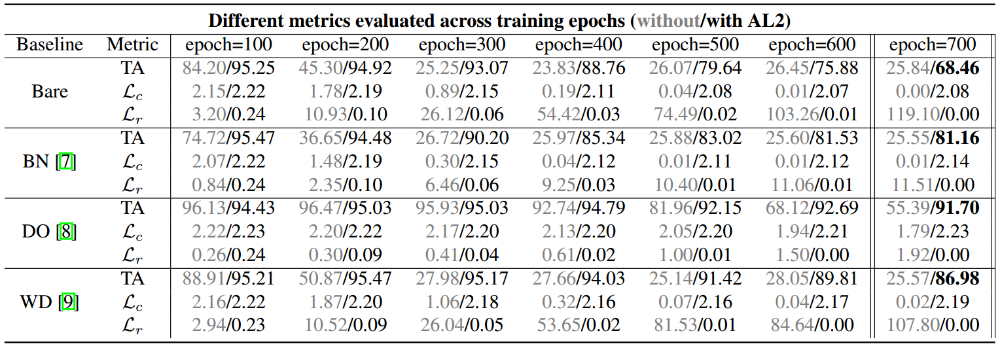

# AL2: Progressive Activation Loss for Learning General Representations in Classification Neural Networks (ICASSP 2020)

[Majed El Helou](https://majedelhelou.github.io/), Frederike Dümbgen and Sabine Süsstrunk

[**Paper**](https://infoscience.epfl.ch/record/274623/)  ---  [**Supplementary Material**](https://infoscience.epfl.ch/record/271444)

> **Abstract:** *The large capacity of neural networks enables them to learn complex functions. To avoid overfitting, networks however require a lot of training data that can be expensive and time-consuming to collect. A common practical approach to attenuate overfitting is the use of network regularization techniques. We propose a novel regularization method that progressively penalizes the magnitude of activations during training. The combined activation signals produced by all neurons in a given layer form the representation of the input image in that feature space. We propose to regularize this representation in the last feature layer before classification layers. Our method's effect on generalization is analyzed with label randomization tests and cumulative ablations. Experimental results show the advantages of our approach in comparison with commonly-used regularizers on standard benchmark datasets.* 


### Using AL2 on your Network
Adding AL2 regularization into the training of a network is straight-forward. The network is split into a trunk that extracts features, and a head that uses the features for the target task such as classification. AL2 adds a progressive loss on the activations of the trunk. While weight decay applies a regularization on network weights, we noticed empirically that it has the opposite effect on the trunk's activations (the parameter for weight decay was chosen empirically to optimize classification accuracy). As shown in the table below, even batch normalization and dropout have a stronger regularization effect on the activations than weight decay, though significantly less than AL2.

The weight for the progressive AL2 loss is given by the function `get_map_weights` in `code/funnelNet_utils.py`.

Our code is built with PyTorch 0.4, tested on Ubuntu 16.04 (Python3.7, CUDA9.0).

### Sample Evaluation Results
Test accuracy, training cross-entropy loss, and our training regularization loss which is shown for AL2 multiplied by 100 for readability. We evaluate all metrics at different epochs and with different baselines (no regularization Bare, batch normalization BN, dropout DO, and weight decay WD), without/with AL2. The networks are trained on the MNIST dataset with 75% corrupt labels:

<p align="center">
  
</p>

### SVCCA Analaysis (Sec 5.1)
The svcca/pwcca analysis is performed using Google's svcca repository. The repository is included as a submodule here, so it is automatically cloned by running the following command to clone this repository

```
git clone -recursive https://github.com/majedelhelou/AL2
```

After running the training you can use the `code/evaluate.py` script to perform the analysis (Figure 1 in the paper). 

### Ablation Analysis (Sec 5.2)
To reproduce the results of the cumulative ablation experiments on any network architecture, it is enough to set to zero, for every given ablation percentage, the same percentage of activations in the feature representation layer. These activations are obtained by feeding through the network trunk the training samples, and then feeding into the last layers (network head) the remaining activations to obtain the class prediction.

### Citation

    @inproceedings{elhelou2020al2,
        title={{AL2}: Progressive Activation Loss for Learning General Representations in Classification Neural Networks},
        author={El Helou, Majed and D{\"u}mbgen, Frederike and S{\"u}sstrunk, Sabine},
        booktitle={ICASSP},
        year={2020}
    }
